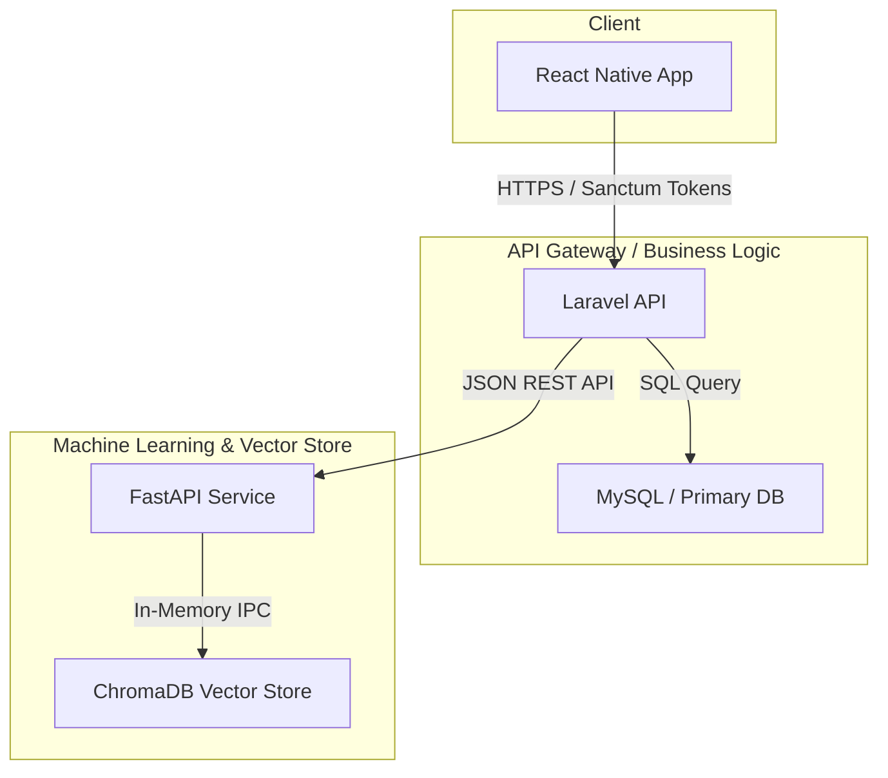

# System Architecture — Guised Up

This document details the architectural layout, core patterns, database structures, and design decisions of the Guised Up authenticity-first platform.

---

## 1. System Overview

Guised Up is organized into three decoupled services:
- **Frontend App (React Native/Expo)**: A mobile-first interface optimized for scrolling, semantic search, and optimistic interactions.
- **Application Backend (Laravel API)**: Serves HTTP endpoints, acts as the primary data store (MySQL/SQLite), and manages user authentication and business ranking logic.
- **Embedding/Vector Service (Python FastAPI)**: Houses the machine learning stack. Generates text embeddings locally (SentenceTransformer) and indexes them for nearest-neighbor similarity searches in ChromaDB.



---

## 2. Decoupled Scoring & Strategy Pattern

In order to maintain strict separation of concerns and avoid massive controller models, ranking computation is decoupled from the retrieval flow.

### Composed Ranking Engine

`RankingService` implements `RankingStrategy` and uses Dependency Injection to compose four specialized signal scorers:

1. **`AuthenticityScorer`**: Parses post length (longer content gains bonus), checks vocabulary diversity (ratio of unique words), penalizes shouting (ALL CAPS ratio), and normalizes against the author's platform authenticity profile score.
2. **`RelationshipScorer`**: Normalizes follow edges and viewer interaction history into a weight between $0.0$ and $1.0$.
3. **`SimilarityScorer`**: Resolves cosine similarity of vectors fetched from the Python Embedding Service, defaulting to $0.5$ if the viewer or posts lack embedding metadata.
4. **`RecencyScorer`**: Evaluates exponential decay curves: $e^{-\lambda \times \text{hours}}$ where $\lambda = 0.05$ (meaning posts degrade by half in roughly 14 hours).

```php
// app/Services/RankingService.php
public function computeCompositeScore(Post $post, User $viewer, ?float $similarityScore = null): float
{
    $a = $this->authenticityScorer->score($post);
    $r = $this->relationshipScorer->score($viewer, $post->user);
    $s = $similarityScore ?? $this->similarityScorer->score($post, $viewer);
    $t = $this->recencyScorer->score($post);

    return ($this->weights['authenticity'] * $a) +
           ($this->weights['relationship'] * $r) +
           ($this->weights['similarity']   * $s) +
           ($this->weights['recency']      * $t);
}
```

---

## 3. Database Schema & Index Design

The system runs on a relational schema designed to avoid slow queries on feed aggregation.

### Schema Relationships
- **`users`**: Extended with a platform-wide `authenticity_score` representing account trust (0–100).
- **`posts`**: References the creator (`user_id`), holds computed post-level `authenticity_score`, and records a string ID pointing to ChromaDB (`embedding_id`).
- **`interactions`**: Tracks user reactions (`like`, `love`, `insightful`, `disagree`). Has a composite unique constraint `(user_id, post_id, type)` preventing duplicated reactions.
- **`relationships`**: Social follow edges with a strength coefficient (0–10) that increments on interaction.

### Database Indexes

| Table | Column(s) | Type | Rationale |
|---|---|---|---|
| `posts` | `user_id` | B-Tree | Speeds up filtering posts by authors followed by the viewer. |
| `posts` | `created_at` | B-Tree | Critical for selecting the top 200 recent candidates before scoring. |
| `interactions` | `post_id` | B-Tree | Allows fast aggregation of reaction totals per post. |
| `relationships` | `(follower_id, following_id)` | Unique B-Tree | Optimizes relationship strength lookups during feed generation. |

---

## 4. Graceful Degradation (Vector Search Fallbacks)

AI services introduce latency and external points of failure. Guised Up treats the Python service as an optional enhancer:

- **Similarity Scorer Fallback**: If the embedding service returns connection errors or times out, the backend logs the warning and falls back to a neutral score ($0.5$).
- **Search Fallback**: If a user runs a search query and the vector service is unreachable, `SearchService` intercepts the error and executes a traditional `LIKE '%term%'` database query so search functionality remains online.

```php
// app/Services/SearchService.php
try {
    $vectorResults = $this->embeddingClient->search($query, $perPage);
} catch (\Exception $e) {
    Log::warning("Embedding service offline. Falling back to LIKE search.");
    return Post::where('content', 'LIKE', "%{$query}%")->paginate($perPage);
}
```
