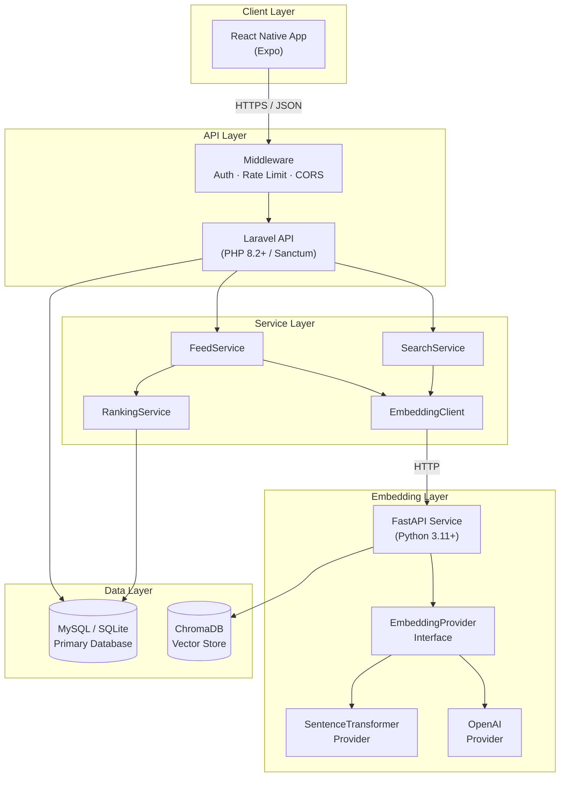
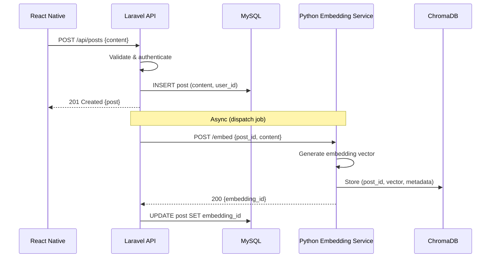
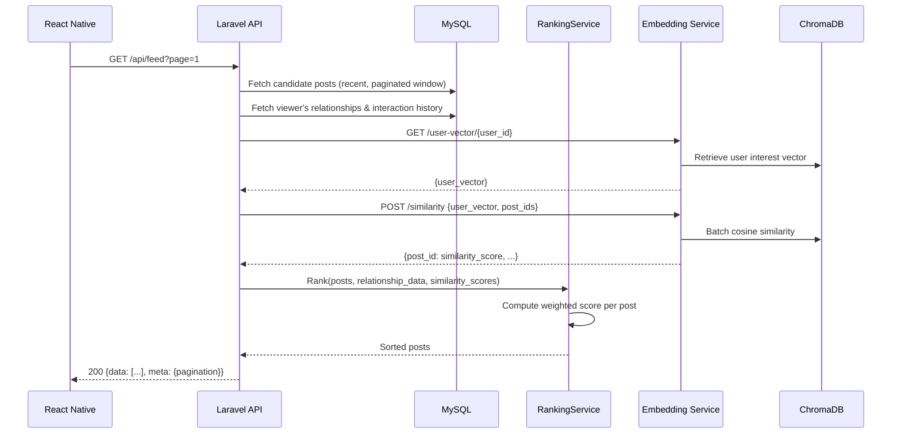
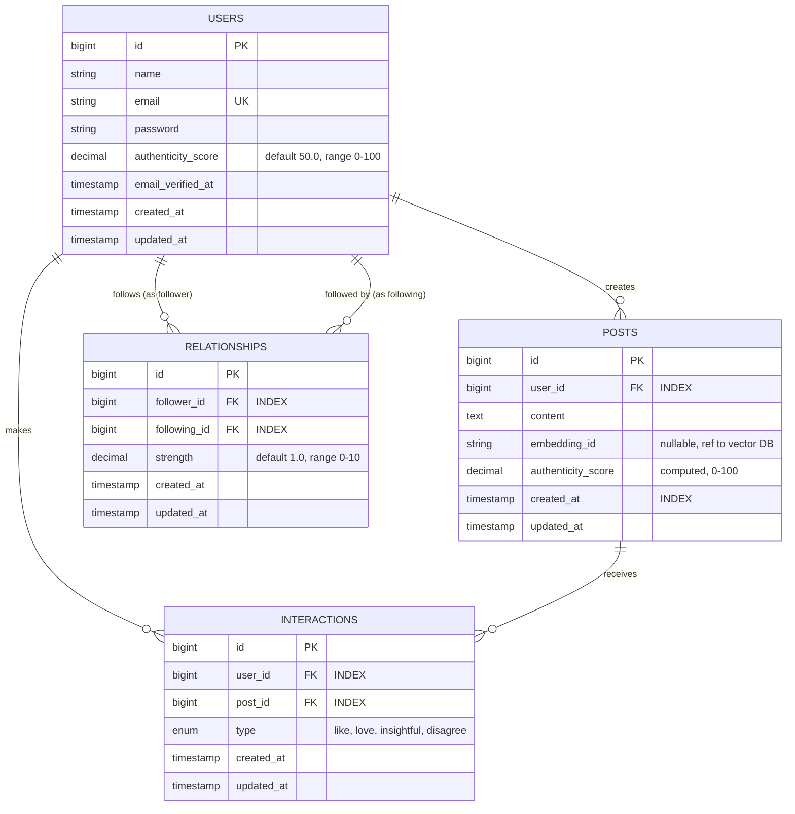
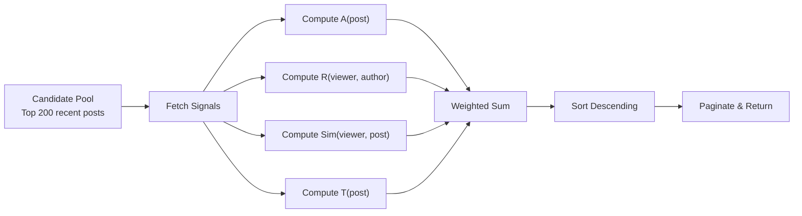
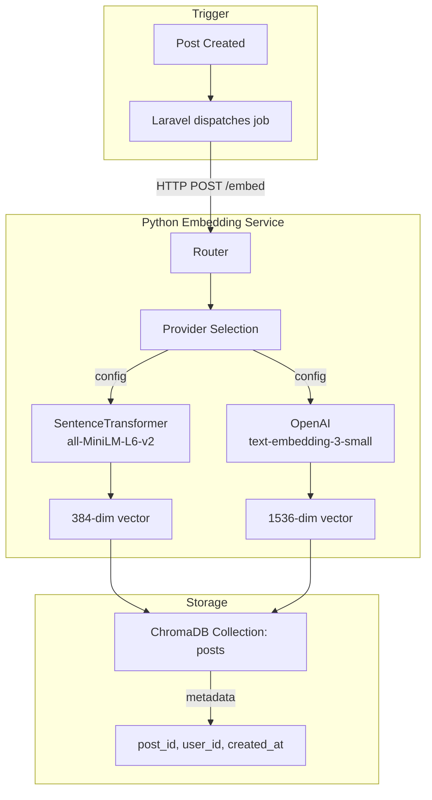
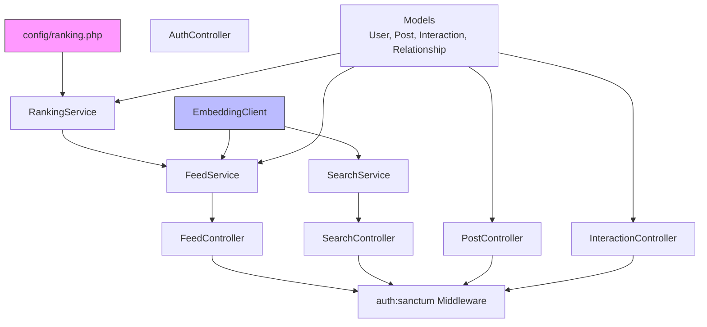

# Technical Solution Document — Guised Up

**Version**: 1.0  
**Author**: Founding Staff Engineer  
**Date**: 2026-07-15  
**Status**: Draft

---

## 1. Executive Summary

Guised Up is an authenticity-first social media platform that uses AI-powered ranking to surface genuine content over performative posts. The system combines traditional relational data (users, posts, interactions) with vector embeddings for semantic understanding, producing a personalized feed scored on four signals: authenticity, relationship strength, semantic similarity, and recency.

---

## 2. System Architecture

### 2.1 Architecture Diagram



### 2.2 Data Flow — Post Creation



### 2.3 Data Flow — Feed Retrieval



---

## 3. Database Schema

### 3.1 Entity Relationship Diagram



### 3.2 Index Strategy

| Table | Index | Type | Rationale |
|-------|-------|------|-----------|
| `posts` | `user_id` | B-Tree | Feed filtering by author |
| `posts` | `created_at` | B-Tree | Time-based sorting and decay |
| `interactions` | `(user_id, post_id, type)` | Unique Composite | Prevent duplicate reactions + fast lookup |
| `interactions` | `post_id` | B-Tree | Count reactions per post |
| `relationships` | `(follower_id, following_id)` | Unique Composite | Prevent duplicate follows + relationship lookup |
| `relationships` | `following_id` | B-Tree | "Who follows this user" queries |

### 3.3 Migration Plan

| Order | Migration | Description |
|-------|-----------|-------------|
| 1 | `create_users_table` | Extends default Laravel users with `authenticity_score` |
| 2 | `create_posts_table` | Core content table with embedding reference |
| 3 | `create_interactions_table` | Reaction/interaction tracking |
| 4 | `create_relationships_table` | Social graph edges with strength |

---

## 4. Authentication Strategy

### 4.1 Approach: Laravel Sanctum (Token-Based)

| Aspect | Decision |
|--------|----------|
| **Mechanism** | API token authentication via `Authorization: Bearer {token}` |
| **Why Sanctum** | Lightweight, first-party Laravel package. Perfect for SPA/mobile. No OAuth complexity. |
| **Token storage** | `personal_access_tokens` table (Sanctum default) |
| **Token scope** | No scopes needed for this assessment |
| **Mobile flow** | Register → Login → Receive token → Attach to all subsequent requests |

### 4.2 Auth Endpoints

```
POST /api/register   → CreateUser + IssueToken → 201 {user, token}
POST /api/login      → ValidateCredentials + IssueToken → 200 {user, token}
POST /api/logout     → RevokeCurrentToken → 200 {message}
```

### 4.3 Protected Routes

All routes except `register` and `login` are guarded by `auth:sanctum` middleware.

---

## 5. API Contracts

### 5.1 Response Envelope

Every response follows this structure:

```json
{
  "success": true|false,
  "data": { ... } | [ ... ] | null,
  "meta": { ... } | null,
  "message": "Human-readable status"
}
```

Error responses additionally include:

```json
{
  "success": false,
  "message": "Validation failed",
  "errors": { "field": ["Error message"] }
}
```

### 5.2 Endpoint Specifications

#### `POST /api/register`

| Field | Type | Rules |
|-------|------|-------|
| name | string | required, max:255 |
| email | string | required, email, unique:users |
| password | string | required, min:8, confirmed |

**Response**: `201 Created`
```json
{
  "success": true,
  "data": {
    "user": { "id": 1, "name": "Jane", "email": "jane@example.com" },
    "token": "1|abc123..."
  },
  "message": "Registration successful"
}
```

#### `POST /api/login`

| Field | Type | Rules |
|-------|------|-------|
| email | string | required, email |
| password | string | required |

**Response**: `200 OK` (same shape as register)  
**Error**: `401 Unauthorized`

#### `POST /api/posts`

| Field | Type | Rules |
|-------|------|-------|
| content | string | required, min:1, max:5000 |

**Response**: `201 Created`
```json
{
  "success": true,
  "data": {
    "id": 42,
    "content": "Being genuine matters more than going viral.",
    "user": { "id": 1, "name": "Jane" },
    "authenticity_score": 72.5,
    "reactions_count": 0,
    "created_at": "2026-07-15T14:30:00Z"
  },
  "message": "Post created successfully"
}
```

#### `GET /api/feed`

| Param | Type | Default | Description |
|-------|------|---------|-------------|
| page | int | 1 | Page number |
| per_page | int | 20 | Items per page (max 50) |

**Response**: `200 OK`
```json
{
  "success": true,
  "data": [
    {
      "id": 42,
      "content": "...",
      "user": { "id": 1, "name": "Jane", "authenticity_score": 82.3 },
      "authenticity_score": 72.5,
      "ranking_score": 0.847,
      "reactions_count": 5,
      "user_reaction": "love",
      "created_at": "2026-07-15T14:30:00Z"
    }
  ],
  "meta": {
    "current_page": 1,
    "per_page": 20,
    "total": 150,
    "last_page": 8
  },
  "message": "Feed retrieved successfully"
}
```

#### `GET /api/search`

| Param | Type | Rules |
|-------|------|-------|
| q | string | required, min:2, max:500 |
| page | int | optional, default:1 |
| per_page | int | optional, default:20 |

**Response**: Same shape as feed, ordered by semantic similarity instead of composite score.

#### `POST /api/interactions`

| Field | Type | Rules |
|-------|------|-------|
| post_id | int | required, exists:posts,id |
| type | string | required, in:like,love,insightful,disagree |

**Response**: `201 Created` (new) or `200 OK` (toggled off)
```json
{
  "success": true,
  "data": { "post_id": 42, "type": "love", "action": "created" },
  "message": "Reaction recorded"
}
```

### 5.3 HTTP Status Code Usage

| Code | Usage |
|------|-------|
| 200 | Successful retrieval or update |
| 201 | Successful creation |
| 401 | Unauthenticated |
| 403 | Unauthorized |
| 404 | Resource not found |
| 422 | Validation error |
| 429 | Rate limit exceeded |
| 500 | Server error |

---

## 6. Feed Ranking Algorithm

### 6.1 Formula

```
S(post, viewer) = w_a × A(post) + w_r × R(viewer, author) + w_s × Sim(viewer, post) + w_t × T(post)
```

### 6.2 Signal Computation

#### Authenticity Score — `A(post)`

```
A(post) = normalize(author.authenticity_score) × content_quality_factor

where:
  normalize(x) = x / 100                    # Scale 0-100 → 0-1
  content_quality_factor:
    base = 1.0
    if len(content) > 50: +0.1              # Substantive content bonus
    if unique_words_ratio > 0.7: +0.1       # Vocabulary diversity bonus
    clamp(base, 0.0, 1.0)
```

> **Design note**: `author.authenticity_score` is seeded per user and updated based on community interaction patterns. For the assessment, we seed realistic values and compute post-level scores from author scores + content heuristics.

#### Relationship Score — `R(viewer, author)`

```
R(viewer, author) = normalize(relationship.strength)

where:
  normalize(x) = min(x / 10.0, 1.0)        # strength range 0-10 → 0-1
  
  If no relationship exists: R = 0.0
```

> Relationship strength is incremented when the viewer interacts with the author's posts (+0.5 per interaction, capped at 10.0).

#### Semantic Similarity — `Sim(viewer, post)`

```
Sim(viewer, post) = cosine_similarity(viewer_interest_vector, post_embedding)

where:
  viewer_interest_vector = mean(embeddings of posts the viewer has interacted with)
  post_embedding = embedding of post.content
  
  Result naturally falls in [0, 1] for normalized vectors.
  If viewer has no interactions: Sim = 0.5 (neutral default)
```

#### Time Decay — `T(post)`

```
T(post) = exp(-λ × hours_since_post)

where:
  λ = 0.05                                  # Configurable decay rate
  hours_since_post = (now - post.created_at) in hours
  
  Examples:
    0 hours  → 1.000
    6 hours  → 0.741
    24 hours → 0.301
    48 hours → 0.091
    72 hours → 0.027
```

### 6.3 Default Weights

```php
// config/ranking.php
return [
    'weights' => [
        'authenticity' => 0.30,
        'relationship' => 0.25,
        'similarity'   => 0.25,
        'recency'      => 0.20,
    ],
    'decay_rate' => 0.05,
    'candidate_pool_size' => 200,   // Pre-filter top N recent posts before ranking
    'per_page_default' => 20,
    'per_page_max' => 50,
];
```

### 6.4 Ranking Pipeline



---

## 7. Vector Embedding Workflow

### 7.1 Embedding Pipeline



### 7.2 Provider Abstraction

```python
# Abstract base — all providers implement this
class EmbeddingProvider(ABC):
    @abstractmethod
    def embed(self, text: str) -> list[float]: ...
    
    @abstractmethod
    def embed_batch(self, texts: list[str]) -> list[list[float]]: ...
    
    @abstractmethod
    def dimension(self) -> int: ...
```

| Provider | Model | Dimensions | Cost | Latency | Use Case |
|----------|-------|-----------|------|---------|----------|
| **SentenceTransformer** (default) | `all-MiniLM-L6-v2` | 384 | Free | ~50ms | Local dev, take-home |
| **OpenAI** (swappable) | `text-embedding-3-small` | 1536 | $0.02/1M tokens | ~200ms | Production |

### 7.3 Python Service Endpoints

| Method | Endpoint | Description |
|--------|----------|-------------|
| POST | `/embed` | Embed text, store in ChromaDB |
| POST | `/embed-batch` | Batch embed multiple texts |
| POST | `/similarity` | Get similarity scores between a query vector and stored posts |
| GET | `/search?q=&limit=` | Semantic search — embed query, find nearest neighbors |
| GET | `/user-vector/{user_id}` | Get aggregated interest vector for a user |
| GET | `/health` | Service health check |

---

## 8. Vector Database Justification

### 8.1 Why ChromaDB?

| Criterion | ChromaDB | Pinecone | Weaviate | pgvector |
|-----------|----------|----------|----------|----------|
| **Setup complexity** | `pip install` | API key + account | Docker + config | PostgreSQL extension |
| **Cost** | Free | Free tier limited | Free (self-hosted) | Free |
| **Take-home suitability** | ★★★★★ | ★★★☆☆ | ★★☆☆☆ | ★★★★☆ |
| **Python integration** | Native | SDK | SDK | SQLAlchemy |
| **No external deps** | ✅ | ❌ (needs API) | ❌ (needs Docker) | ❌ (needs PostgreSQL) |
| **Production upgrade path** | → Pinecone/Weaviate | Already there | Already there | Already there |

### 8.2 Decision

**ChromaDB** because:
1. Zero-configuration — runs in-process or as a local server
2. No API keys, no accounts, no external services
3. Native Python client with clean API
4. Supports metadata filtering and batch operations
5. Easy to swap out later via the `VectorStore` abstraction

---

## 9. Tradeoffs

| Decision | Tradeoff | Justification |
|----------|----------|---------------|
| Separate Python service | Added network hop + deployment complexity | Embedding ecosystem is Python-native. Attempting this in PHP would be fragile and non-idiomatic. |
| ChromaDB over pgvector | Not production-grade at scale | Take-home doesn't need horizontal scaling. ChromaDB demonstrates the concept cleanly. |
| Synchronous embedding in seeder, async in production flow | Seeder is slow for large datasets | Acceptable for demo data (~100 posts). Real production would use queue workers. |
| Heuristic authenticity scores | Not ML-based | Building a real authenticity model is out of scope. Heuristics demonstrate the architecture. |
| SQLite for dev, MySQL for "production" | SQLite has limited concurrent write support | Single developer, no concurrency issues. Laravel handles the abstraction. |
| `all-MiniLM-L6-v2` (384d) | Lower accuracy than larger models | 5x faster, good enough for semantic similarity in a demo. Swappable via config. |
| Candidate pool pre-filter (200 posts) | Could miss relevant older posts | Keeps ranking computation bounded. Configurable via `ranking.candidate_pool_size`. |
| No real-time updates | Feed may feel stale | Polling on pull-to-refresh is sufficient for assessment. WebSockets are out of scope. |

---

## 10. AI Workflow Documentation

### 10.1 AI Usage Policy

All significant AI usage during development will be documented in `docs/AI_USAGE.md` with:

| Field | Description |
|-------|-------------|
| **Problem** | What engineering problem was being solved |
| **Prompt Objective** | What was asked of the AI |
| **Generated Output** | What the AI produced (summarized) |
| **Human Modifications** | What was changed, rejected, or rewritten |
| **Engineering Decision** | Why the final approach was chosen |

### 10.2 Where AI Is Used in the System

| Component | AI Role | Implementation |
|-----------|---------|----------------|
| **Post Embeddings** | Convert text → vector representation | SentenceTransformer model (local inference) |
| **Semantic Search** | Find posts by meaning, not keywords | Cosine similarity in vector space |
| **User Interest Vector** | Aggregate embeddings of interacted posts | Mean pooling of interaction embeddings |
| **Authenticity Scoring** | Heuristic (NOT AI) | Rule-based computation — no ML model |

> [!NOTE]  
> The ranking algorithm itself is **not AI/ML**. It is a deterministic weighted scoring function. The only AI component is the embedding generation for semantic features.

### 10.3 Model Selection Rationale

| Model | `all-MiniLM-L6-v2` |
|-------|---------------------|
| **Parameters** | 22.7M |
| **Dimensions** | 384 |
| **Speed** | ~50ms per embedding |
| **Quality** | Top-10 on MTEB at its size class |
| **License** | Apache 2.0 |
| **Why chosen** | Best quality/speed ratio for a local demo. No API keys. Runs on CPU. |

---

## 11. Component Dependency Map



---

## 12. Security Considerations

| Concern | Mitigation |
|---------|-----------|
| SQL injection | Eloquent ORM parameterized queries |
| XSS | API-only (no blade views); JSON responses |
| CSRF | Not applicable (token auth, no cookies) |
| Mass assignment | `$fillable` on all models |
| Rate limiting | Laravel's built-in `throttle` middleware |
| Password storage | bcrypt via `Hash::make()` |
| Token exposure | Sanctum tokens hashed in DB; plaintext only returned once |
| Embedding service access | Internal network only; no public exposure |

---

